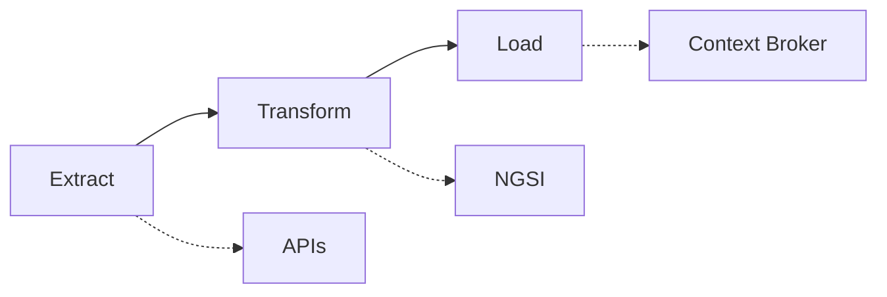
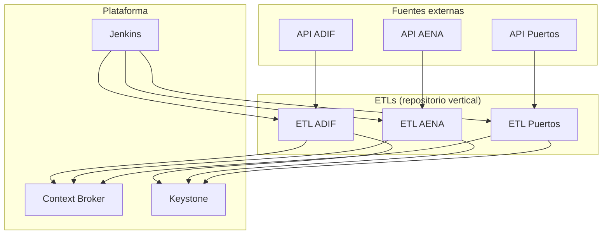

# Transferencia de conocimiento: ETLs AENA, ADIF y SEAPORTS

---

## 1. Procedimiento de una ETL

**ETL** = Extracción de APIs externas → **Transformación** a modelos NGSI (estructura definida) → **Carga** en el Context Broker con **tc-etl-lib**.

---

## 2. ETLs

**archivo compartido con la documentación completa**  
**repositorio de cada ETL en GitHub**

### 2.1 ETL ADIF (ferrocarril)

| Aspecto | Detalle |
|---------|---------|
| **Fuente de datos** | APIs de Transporte ferroviario: estaciones y circulaciones (llegadas/salidas). |
| **Método de autenticación** | **API Key** en header: `User-key: <API_KEY>`. Las claves se configuran por variables de entorno. |
| **Endpoints** | • **Estaciones:** URL de estaciones + API Key en header.   • **Circulaciones:** URLs de llegadas y de salidas  + API Key; en el body se envían los **códigos de estación** (`ETL_ADIF_STATION_CODES_ARRIVALS` / `DEPARTURES`). Sin esos códigos y la key no hay respuesta útil. |
| **Modelo de transformación** | **Station** (estaciones) y **CommercialPath** (caminos comerciales / circulaciones). Modelo NGSI documentado en la doc. |
| **Frecuencia** | Ejecución **diaria** (programada). |

---

### 2.2 ETL AENA (aeropuertos)

| Aspecto | Detalle |
|---------|---------|
| **Fuente de datos** | API de AENA: vuelos de llegada y salida por aeropuerto. |
| **Método de autenticación** | **JWT (Bearer Token)**. Primera llamada POST al endpoint de token con **Basic Auth** (`consumer_key:consumer_secret` en Base64). Luego se usa el token en `Authorization: Bearer <token>`. |
| **Endpoints (qué se necesita para que devuelva la info)** | • **Token:** POST a la URL de token con `grant_type=client_credentials` y Basic Auth (consumer_key + secret_key). Sin token válido no se puede llamar a los datos.   • **Datos:** URL base + path por recurso. Para cada aeropuerto se llama a `/vuelos-llegada/{aeropuerto}` y `/vuelos-salida/{aeropuerto}`; el **código de aeropuerto** (ej. VLC) es obligatorio en la URL. La lista de aeropuertos se configura por variable (`ETL_AENA_API_SETTINGS_AIRPORTS`). |
| **Modelo de transformación** | **Transport** (vuelos). Modelo NGSI documentado. |
| **Frecuencia** | Ejecución **semanal** (según documentación)

---

### 2.3 ETL Seaports (Puertos)

| Aspecto | Detalle |
|---------|---------|
| **Fuente de datos** | API de puertos: datos de escalas, visitas de un barco a un puerto (port calls) en un rango de fechas. |
| **Método de autenticación** | **Token OAuth**: POST al servicio de autenticación con `username` y `password`; en la respuesta se obtiene un token que se envía como `Authorization: Bearer <access_token>`. |
| **Endpoints** | • **Autenticación:** POST a la URL de token con `username` y `password`; sin token la API de datos no responde.   • **Datos:** GET a la URL base de la API con **parámetros obligatorios** `dateFrom` y `dateTo` (formato YYYY-MM-DDTHH:MM:SS.SSSZ). Si no se envían fechas, la ETL usa el día anterior por defecto. Sin fechas correctas no hay datos de escalas. |
| **Modelo de transformación** | **PortCall** (escalas). Modelo NGSI documentado. |
| **Frecuencia** | Ejecución **diaria** (automática). Por defecto se usa el día anterior si no se indican fechas. |

---

## 3. Estándares y prácticas comunes del vertical

En todas las ETLs del vertical se siguen **mismas prácticas** para mantener coherencia y que el despliegue automatizado funcione:

- **Variables de entorno:** Toda la configuración sensible y por entorno (URLs, credenciales, servicios) va en variables de entorno, **nunca** hardcodeada.
- **Librería estándar tc-etl-lib:** Se usa para autenticación (Keystone) y para subir entidades al Context Broker (Orion). Está documentada y es la referencia para la carga.
- **Variables configurables para el Context Broker:** Servicio, subservicio, endpoint del CB, endpoint de Keystone, etc. Suelen estar agrupadas en un **archivo estándar de configuración** (por ejemplo `config.py` + variables con prefijo `ETL_<VERTICAL>_ENVIRONMENT_*` y `ETL_<VERTICAL>_SETTINGS_*`).
- **Archivo estándar de configuración:** En muchas ETLs existe un fichero (p.ej. `config.py`) que centraliza la lectura de variables de entorno y, en despliegues SaaS, ejemplos como `env.sample.json` / `env.secrets.sample.json`. No son archivos “al azar”: tienen un formato y nombres de variables que el **procedimiento automatizado de despliegue** espera.

---

## 4. Despliegue automatizado

- En el repositorio del vertical no solo está el código de la ETL: hay una **estructura común** (transversal) con archivos que el **procedimiento de despliegue automatizado** necesita.
- Esos archivos **no son aleatorios** ni documentación suelta: tienen **formato y variables concretas** que Jenkins (o la herramienta que se use) espera para:
  - Entender qué ETL es.
  - Qué variables inyectar (entorno, secrets).
  - Cómo y cuándo ejecutar (frecuencia, comandos).

---

## 6. Jenkins

- Las ETLs se despliegan y/o ejecutan en  **Jenkins** donde queda todo configurado.
  - **Dónde** está el Jenkins (o enlace al pipeline).
  - **Qué hace el job:** despliegue del código, inyección de variables, ejecución programada o manual.
  - **Frecuencia** por ETL (diaria ADIF/Puertos, manual AENA, etc.)

---

## 7. Código de la ETL a alto nivel

1. **Carga de configuración:** Lectura de variables de entorno (CB, Keystone, servicio, subservicio, URLs y credenciales de la API).
2. **Autenticación contra la API fuente:** Según la ETLw
3. **Extracción:** Llamadas a los **endpoints** con la URL correcta, método (GET/POST), cabeceras y **parámetros que pide cada API** (códigos de estación, aeropuerto, dateFrom/dateTo, etc.). Es crítico tener bien configurados endpoint y parámetros para que la API funcione y devuelva la información.
4. **Transformación:** Mapeo de la respuesta de la API al **modelo NGSI** (Station, CommercialPath, Transport, Hubs, PortCall, etc.).
5. **Autenticación contra Keystone** (usando tc-etl-lib) para obtener token de acceso al Context Broker.
6. **Carga:** Envío de entidades al Context Broker (Orion) en batch, usando **tc-etl-lib**, con reintentos y timeouts configurables.

El **código concreto** se comparte desde el **repositorio oficial** del vertical; este documento sirve solo de guión para explicar el “qué” y el “cómo” a alto nivel.

---

## 8. Documentación de referencia

Todo el detalle técnico (modelos NGSI, autenticación, endpoints, variables, ejecución, código) estará en el **archivo compartido con la documentación completa** o en el **repositorio de cada ETL en GitHub**.

---

## 9. Diagrama de contexto general

---
