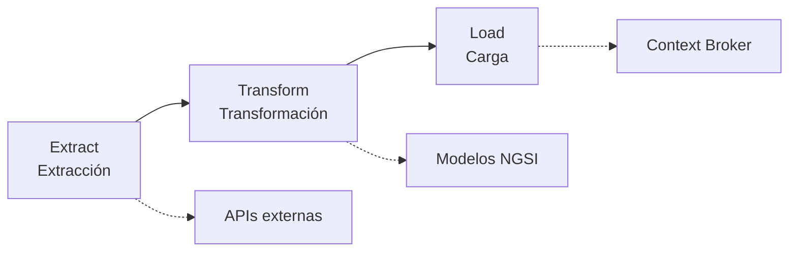

# Transferencia de conocimiento: ETLs y Smart Cities (Valencia)

**Warpcom · Context Broker · Vertical Valencia**  
*Documento base para la presentación*

---

## 1. Bienvenida y dinámica de la sesión

- **Objetivo:** Que todo quede lo más claro posible.
- **Dinámica:** Es una **conversación**. Si en cualquier momento algo no queda claro o queréis profundizar, **preguntad sin problema** mientras hablo.
- **Nivel:** Repaso de nivel medio-alto: muchas etapas, pero sin bajar al detalle de cada línea de código (el código lo compartiré desde el repositorio oficial).

---

## 2. ¿Qué es un proceso ETL?

Un **ETL** (Extract, Transform, Load) es un flujo de datos en tres fases:

| Fase | Qué hacemos |
|------|-------------|
| **Extract** | Obtenemos la información de **APIs externas**. Para el desarrollo nos compartieron la documentación oficial de cada API. |
| **Transform** | Los datos pasan por un proceso de **transformación** a **modelos concretos** (NGSI). Cada modelo tiene una estructura definida (entidades, atributos, tipos). |
| **Load** | El **objetivo final** de todas las ETLs es **cargar la información en el Context Broker**. Para ello usamos la librería **tc-etl-lib**, que está documentada y es común a las ETLs del vertical. |

Todas las ETLs de las que hablamos siguen este patrón y usan **tc-etl-lib** para la carga en el Context Broker.

---

## 3. Resumen por ETL: fuente, autenticación, endpoints, modelo y frecuencia

Todo el detalle técnico (modelos, variables, código, etc.) estará en el **archivo compartido con la documentación completa** o en el **repositorio de cada ETL en GitHub**. Aquí va un resumen ejecutivo para la presentación.

### Pasos para la obtención de la información (énfasis en extracción)

Para que cada API **devuelva la información** hace falta cumplir bien la etapa de **extracción**:

1. **Autenticación previa:** Tener resueltas las credenciales (API Key, usuario/contraseña o consumer_key/secret) y, si aplica, **obtener el token** (JWT, OAuth) antes de llamar a los endpoints de datos. Sin autenticación correcta la API no devuelve datos o devuelve error.
2. **Endpoint correcto:** Conocer la **URL base** y el **path** de cada recurso (estaciones, circulaciones, vuelos, port calls, etc.). Cada ETL tiene sus URLs configuradas por variables de entorno.
3. **Parámetros obligatorios:** Enviar lo que la API exige: códigos de estación, código de aeropuerto, `dateFrom`/`dateTo`, `grant_type`, etc. Si falta algo requerido, la respuesta puede estar vacía o fallar.
4. **Método y cabeceras:** Usar el método indicado (GET, POST) y las cabeceras necesarias (`User-key`, `Authorization: Bearer <token>`, etc.) en cada petición.

Resumiendo: **autenticación + endpoint correcto + parámetros necesarios** son lo que hace que la API funcione y devuelva la info; el resto del flujo (transformación y carga) depende de tener ya esos datos.

### 3.1 ETL ADIF (ferrocarril)

| Aspecto | Detalle |
|---------|---------|
| **Fuente de datos** | APIs de ADIF: estaciones y circulaciones (llegadas/salidas). |
| **Método de autenticación** | **API Key** en header: `User-key: <API_KEY>`. Las claves se configuran por variables de entorno. |
| **Endpoints (qué se necesita para que devuelva la info)** | • **Estaciones:** URL de estaciones (variable) + API Key en header.   • **Circulaciones:** URLs de llegadas y de salidas (variables) + API Key; en el body se envían los **códigos de estación** (`ETL_ADIF_STATION_CODES_ARRIVALS` / `DEPARTURES`). Sin esos códigos y la key no hay respuesta útil. |
| **Modelo de transformación** | **Station** (estaciones) y **CommercialPath** (caminos comerciales / circulaciones). Modelo NGSI documentado en la doc. |
| **Frecuencia** | Ejecución **diaria** (programada). |

*Detalle completo:* documentación compartida o repositorio de la ETL en GitHub.

---

### 3.2 ETL AENA (aeropuertos)

| Aspecto | Detalle |
|---------|---------|
| **Fuente de datos** | API de AENA: vuelos de llegada y salida por aeropuerto. |
| **Método de autenticación** | **JWT (Bearer Token)**. Primera llamada POST al endpoint de token con **Basic Auth** (`consumer_key:consumer_secret` en Base64). Luego se usa el token en `Authorization: Bearer <token>`. |
| **Endpoints (qué se necesita para que devuelva la info)** | • **Token:** POST a la URL de token con `grant_type=client_credentials` y Basic Auth (consumer_key + secret_key). Sin token válido no se puede llamar a los datos.   • **Datos:** URL base + path por recurso. Para cada aeropuerto se llama a `/vuelos-llegada/{aeropuerto}` y `/vuelos-salida/{aeropuerto}`; el **código de aeropuerto** (ej. GCFV) es obligatorio en la URL. La lista de aeropuertos se configura por variable (`ETL_AENA_API_SETTINGS_AIRPORTS`). |
| **Modelo de transformación** | **Transport** (vuelos) y **Hubs** (aeropuertos). Modelo NGSI documentado. |
| **Frecuencia** | Ejecución **manual** (según documentación). La carga al CB se hace cuando la extracción para todos los aeropuertos configurados ha sido correcta. |

*Detalle completo:* documentación compartida o repositorio de la ETL en GitHub.

---

### 3.3 ETL Puertos (Seaports / Valencia)

| Aspecto | Detalle |
|---------|---------|
| **Fuente de datos** | API de puertos (Valencia): datos de escalas (port calls) en un rango de fechas. |
| **Método de autenticación** | **Token OAuth**: POST al servicio de autenticación con `username` y `password`; en la respuesta se obtiene un token que se envía como `Authorization: Bearer <access_token>`. |
| **Endpoints (qué se necesita para que devuelva la info)** | • **Autenticación:** POST a la URL de token con `username` y `password`; sin token la API de datos no responde.   • **Datos:** GET a la URL base de la API con **parámetros obligatorios** `dateFrom` y `dateTo` (formato YYYY-MM-DDTHH:MM:SS.SSSZ). Si no se envían fechas, la ETL usa el día anterior por defecto. Sin fechas correctas no hay datos de escalas. |
| **Modelo de transformación** | **PortCall** (escalas). Modelo NGSI documentado. |
| **Frecuencia** | Ejecución **diaria** (automática). Por defecto se usa el día anterior si no se indican fechas. |

*Detalle completo:* documentación compartida o repositorio de la ETL en GitHub.

---

## 4. Procedimiento de despliegue

- El código de las ETLs está alojado en un repositorio del **vertical** (por ejemplo, por vertical: ADIF, AENA, Seaports).
- El **despliegue está automatizado**: al subir/actualizar código, el flujo (por ejemplo Jenkins) se encarga de desplegar y dejar todo configurado en la plataforma.
- En la presentación se puede mostrar **dónde está el repo**, **qué job/pipeline** corre y **cada cuánto** (según la frecuencia de cada ETL).

---

## 5. Estándares y prácticas comunes del vertical

En todas las ETLs del vertical se siguen **mismas prácticas** para mantener coherencia y que el despliegue automatizado funcione:

- **Variables de entorno:** Toda la configuración sensible y por entorno (URLs, credenciales, servicios) va en variables de entorno, **nunca** hardcodeada.
- **Librería estándar tc-etl-lib:** Se usa para autenticación (Keystone) y para subir entidades al Context Broker (Orion). Está documentada y es la referencia para la carga.
- **Variables configurables para el Context Broker:** Servicio, subservicio, endpoint del CB, endpoint de Keystone, etc. Suelen estar agrupadas en un **archivo estándar de configuración** (por ejemplo `config.py` + variables con prefijo `ETL_<VERTICAL>_ENVIRONMENT_*` y `ETL_<VERTICAL>_SETTINGS_*`).
- **Archivo estándar de configuración:** En muchas ETLs existe un fichero (p.ej. `config.py`) que centraliza la lectura de variables de entorno y, en despliegues SaaS, ejemplos como `env.sample.json` / `env.secrets.sample.json`. No son archivos “al azar”: tienen un formato y nombres de variables que el **procedimiento automatizado de despliegue** espera.

Esto hace que, quien conozca una ETL del vertical, pueda orientarse rápido en otra.

---

## 6. El transversal (vertical): archivos necesarios para el despliegue automatizado

- En el repositorio del vertical no solo está el código de la ETL: hay una **estructura común** (transversal) con archivos que el **procedimiento de despliegue automatizado** necesita.
- Esos archivos **no son aleatorios** ni documentación suelta: tienen **formato y variables concretas** que Jenkins (o la herramienta que se use) espera para:
  - Entender qué ETL es.
  - Qué variables inyectar (entorno, secrets).
  - Cómo y cuándo ejecutar (frecuencia, comandos).

Mostrar en la presentación la **estructura típica** del repo (por ejemplo `etls/<nombre_etl>/`, `config.py`, `env.sample.json`, `requirements.txt`, etc.) y recalcar que **todos esos archivos son parte del procedimiento automatizado**.

---

## 7. Jenkins (y pipeline de despliegue)

- Las ETLs se despliegan y/o ejecutan en una **plataforma Jenkins** (o equivalente) donde queda todo configurado.
- En la sesión se puede comentar:
  - **Dónde** está el Jenkins (o enlace al pipeline).
  - **Qué hace el job:** build, despliegue del código, inyección de variables, ejecución programada o manual.
  - **Frecuencia** por ETL (diaria ADIF/Puertos, manual AENA, etc.), si aplica.

Así el equipo sabe dónde mirar para re-ejecutar, ver logs o cambiar configuración.

---

## 8. Código de la ETL a alto nivel

Para no alargar la presentación con código, se puede resumir el flujo en pasos:

1. **Carga de configuración:** Lectura de variables de entorno (CB, Keystone, servicio, subservicio, URLs y credenciales de la API).
2. **Autenticación contra la API fuente:** Según la ETL: API Key (ADIF), JWT (AENA), Token OAuth (Puertos). Sin esto los endpoints no devuelven datos.
3. **Extracción:** Llamadas a los **endpoints** con la URL correcta, método (GET/POST), cabeceras y **parámetros que pide cada API** (códigos de estación, aeropuerto, dateFrom/dateTo, etc.). Es crítico tener bien configurados endpoint y parámetros para que la API funcione y devuelva la información.
4. **Transformación:** Mapeo de la respuesta de la API al **modelo NGSI** (Station, CommercialPath, Transport, Hubs, PortCall, etc.).
5. **Autenticación contra Keystone** (usando tc-etl-lib) para obtener token de acceso al Context Broker.
6. **Carga:** Envío de entidades al Context Broker (Orion) en batch, usando **tc-etl-lib**, con reintentos y timeouts configurables.

El **código concreto** se comparte desde el **repositorio oficial** del vertical; este documento sirve solo de guión para explicar el “qué” y el “cómo” a alto nivel.

---

## 9. Documentación de referencia

Todo el detalle técnico (modelos NGSI, autenticación, endpoints, variables, ejecución, código) estará en el **archivo compartido con la documentación completa** o en el **repositorio de cada ETL en GitHub**.

- **Para la presentación:** este documento es la base que se comparte en pantalla.
- **Para el detalle:** usar la documentación completa que se comparta o el repo de la ETL correspondiente en GitHub.

---

## 10. Diagrama de contexto general

---

## Resumen de puntos para no olvidar en la presentación

1. Saludar y dejar claro que se puede preguntar en cualquier momento.
2. Explicar ETL en tres fases: extracción de APIs, transformación a modelos NGSI, carga en Context Broker con tc-etl-lib.
3. Por cada ETL: fuente, autenticación, endpoints, modelo NGSI, frecuencia.
4. Procedimiento de despliegue: código en el repo del vertical, despliegue automatizado.
5. Estándares: variables de entorno, tc-etl-lib, archivo estándar de configuración.
6. Transversal: archivos del repo con formato y variables que el despliegue automatizado necesita.
7. Jenkins: qué hace, dónde está, frecuencia de ejecución por ETL.
8. Código a alto nivel: config → auth API → extracción → transformación → auth Keystone → carga al CB.
9. Código real: compartido desde el repositorio oficial; detalle completo en la documentación compartida o en el repositorio de cada ETL en GitHub.

Si queréis, después de la sesión se puede ampliar este documento con las preguntas que salgan o con enlaces directos a repos y jobs de Jenkins.
